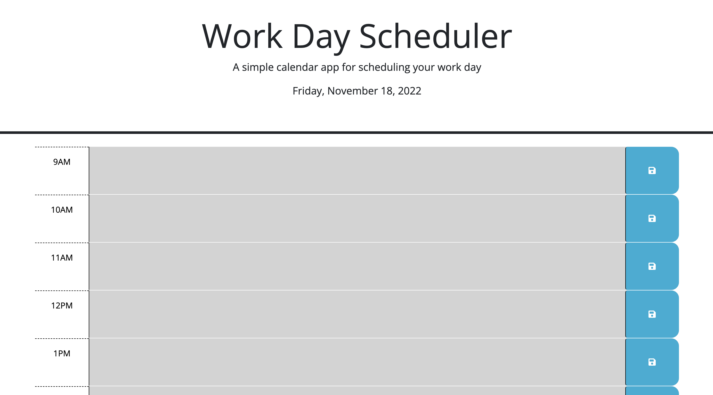

# Third-Party-APIs
Bootcamp Challenge 5

## Your Task

Here, I created a daily scheduler that compares the current hour to hour displayed on the scheduler. Depending on the relative hour, it will display a color to represent the past, present, or future. The application will also save the event even when the page is refreshed. 

## Preview 

Here is a preview of the deployed application.

## Links

https://github.com/ndifiori/Third-Party-APIs

